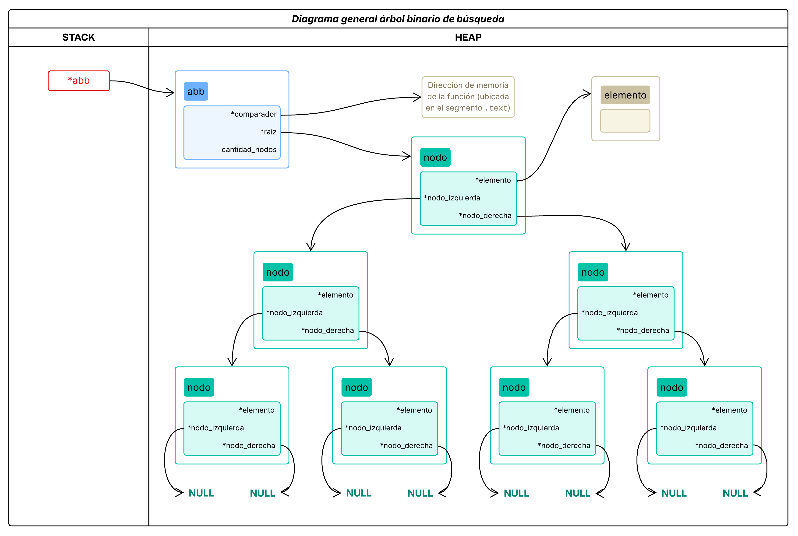
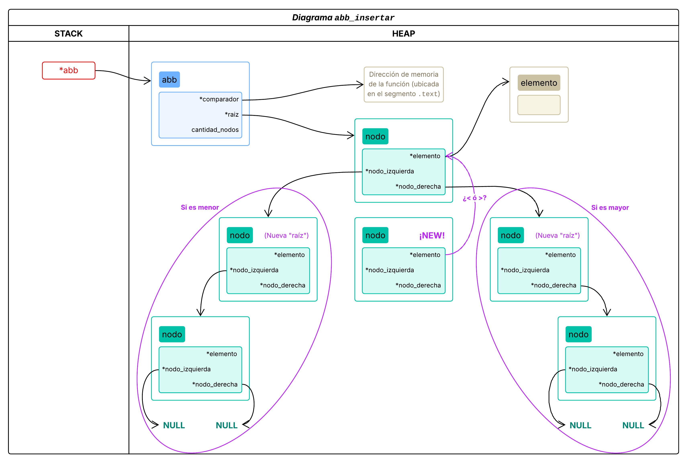
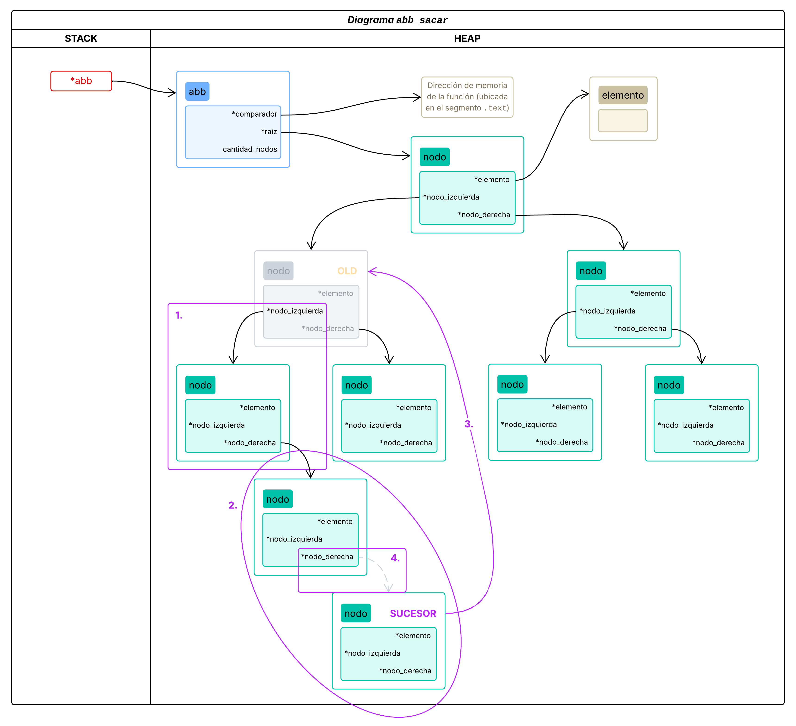
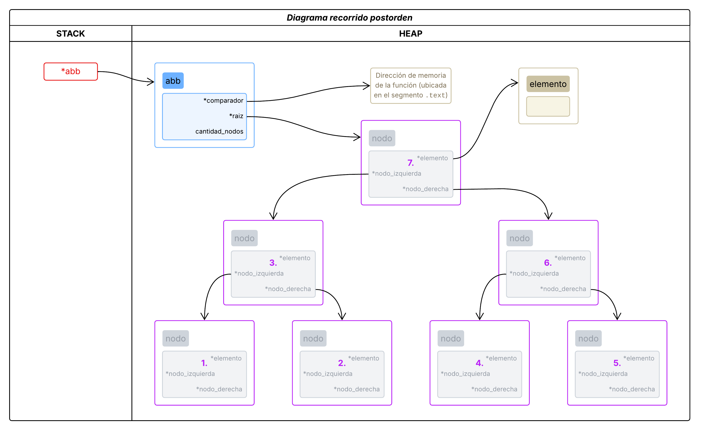
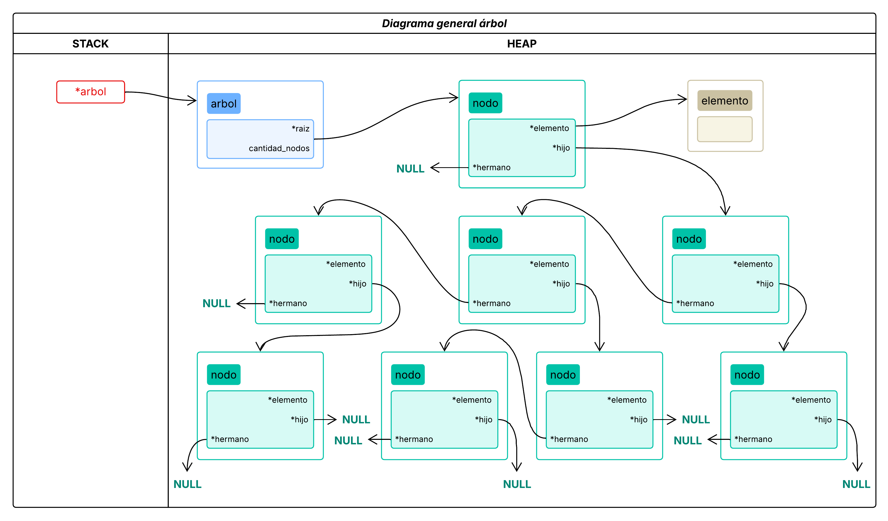
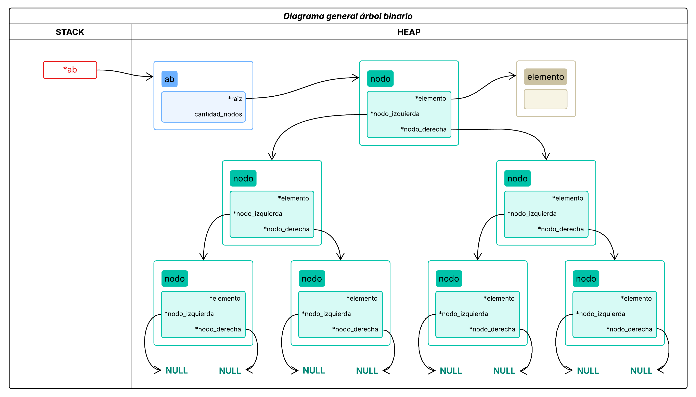

# TDA ABB

- **Alumno:** [Avril Victoria Morfeo Zerbi](https://github.com/AvrilMZ) 
- **Legajo:** 112563 
- **Mail:** amorfeo@fi.uba.ar


### Instrucciones para correr el proyecto:

- Para compilar las pruebas:
```bash
make pruebas_alumno
```

- Para ejecutar las pruebas:
```bash
./pruebas_alumno
```

- Para ejecutar con Valgrind:
```bash
make valgrind-alumno
```

<br>

## Funcionamiento
<div style="text-align: justify">

El progrmama implementa un **árbol binario de búsqueda** (ABB), este tipo de estructura de datos permite almacenar elementos de manera ordenada, ya que los elementos del subárbol izquierdo son menores con respecto al subárbol derecho.  Esta caracteristica permite realizar búsquedas eficientes en tiempo $`O(log(n))`$, por lo que sus usos suelen ser para optimizar búsquedas.

El árbol se implementa con un puntero al nodo raíz, un contador de nodos y una función comparadora para determinar el orden de los elementos. Cada nodo del árbol contiene un elemento, un puntero al hijo izquierdo y un puntero al hijo derecho.

</div>

<div id="imagen1" align="center">
	
	
<sup>Figura 1 (Ejemplo de implementación TDA árbol binario de búsqueda)</sup>
</div>

<div style="text-align: justify">

Se implementan las siguientes primitivas para el ABB:

- `abb_crear`: Crea un árbol binario de búsqueda vacío asignandole la función comparadora pasada por parámetro.
	- Complejidad: $`O(1)`$ en tiempo y $`O(1)`$ en espacio.
- `abb_insertar`: Se compara el elemento de la raíz con el nuevo. Si este es menor, se pasa al subárbol izquierdo; si es mayor, al derecho. La comparación se repite hasta encontrar un nodo con la misma clave, que por convención se inserta en el subárbol derecho, o hasta llegar al final del subárbol correspondiente, donde se debe insertar el nuevo elemento en el lado adecuado. La logica de comparación se puede ver en la [figura 2](#imagen2).
	- Complejidad: $`O(log(n))`$ en tiempo si el árbol esta balanciado, en caso contrario $`O(n)`$, y $`O(1)`$ en espacio.
- `abb_existe`: Devuelve verdadero si el elemento buscado existe en el árbol.
	- Complejidad: $`O(log(n))`$ en tiempo si el árbol esta balanciado, en caso contrario $`O(n)`$, y $`O(h)`$ en espacio, ya que se hace de forma recursiva, donde $`h`$ es la altura del árbol.
- `abb_buscar`: Devuelve el elemento que coincide con el buscado.
	- Complejidad: $`O(log(n))`$ en tiempo si el árbol esta balanciado, en caso contrario $`O(n)`$, y $`O(h)`$ en espacio, ya que se hace de forma recursiva, donde $`h`$ es la altura del árbol.
- `abb_sacar`: Devuelve y elimina la primer aparicion del nodo cuyo elemento coincida con el buscado. Si se saca un nodo con dos hijos no nulos se reemplaza dicho nodo con el predecesor inorden, tal como se visualiza en la [figura 3](#imagen3).
	- Complejidad: $`O(log(n))`$ en tiempo si el árbol esta balanciado, en caso contrario $`O(n)`$, y $`O(h)`$ en espacio, ya que se hace de forma recursiva, donde $`h`$ es la altura del árbol.
- `abb_tamanio`: Devuelve la cantidad de nodos que tiene el árbol.
	- Complejidad: $`O(1)`$ en tiempo y $`O(1)`$ en espacio.
- `abb_vacio`: Devuelve verdadero si el árbol está vacío.
	- Complejidad: $`O(1)`$ en tiempo y $`O(1)`$ en espacio.
- `abb_recorrer`: Recorre el árbol en el orden indicado (inorden, preorden o postorden) aplicando la función dada a cada elemento, finalmente devuelve la cantidad de elementos recorridos. El [preorden](#imagen4) primero recorre la raíz, luego el subárbol izquierdo y finalmente el derecho, lo que permite recrear el árbol. El [inorden](#imagen5) primero recorre el subárbol izquierdo, luego la raíz y finalmente el derecho, lo que facilita obtener todos los elementos en orden. El [postorden](#imagen6) primero recorre el subárbol izquierdo, luego el derecho y finalmente la raíz, siendo ideal para la eliminación de nodos.
	- Complejidad: $`O(n)`$ en tiempo y $`O(h)`$ en espacio, ya que se hace de forma recursiva, donde $`h`$ es la altura del árbol.
- `abb_vectorizar`: Crea un vector con los elementos del árbol en el orden indicado (inorden, preorden o postorden).
	- Complejidad: $`O(n)`$ en tiempo y $`O(h)`$ en espacio, ya que se hace de forma recursiva, donde $`h`$ es la altura del árbol.
- `abb_destruir`: Destruye el árbol y libera la memoria ocupada por sus nodos.
	- Complejidad: $`O(n)`$ en tiempo y $`O(1)`$ en espacio.
- `abb_destruir_todo`: Destruye el árbol y libera la memoria ocupada por sus nodos aplicando la función dada a cada elemento.
	- Complejidad: $`O(n)`$ en tiempo y $`O(1)`$ en espacio.

</div>

<div id="imagen2" align="center">
	

<sup>Figura 2 (Ejemplo de comparación para insertar un nuevo elemento)</sup>
</div>

<div id="imagen3" align="center">
	

<sup>Figura 3 (Representa una eliminación de un nodo con dos hijos. El color gris representa lo que se elimina)</sup>
</div>

<div id="imagen4" align="center">
	

<sup>Figura 4 (Ejemplo de un recorrido preorden. El color gris representa a los nodos previamente mostrados)</sup>
</div>

<div id="imagen5" align="center">
	

<sup>Figura 5 (Ejemplo de un recorrido inorden. El color gris representa a los nodos previamente mostrados)</sup>
</div>

<div id="imagen6" align="center">
	

<sup>Figura 6 (Ejemplo de un recorrido postorden. El color gris representa a los nodos previamente mostrados)</sup>
</div>

## Contexto teórico
<div style="text-align: justify">

Si bien se implemento un árbol binario de búsqueda principalemente se debe entender el concepto de un árbol y un árbol binario. 

Un **árbol** es una estructura de datos jerárquica que consiste en nodos conectados entre sí. Cada nodo puede tener cero o más hijos, y un único padre, este puede estar conectado directa o indirectamente. Un ejemplo de uso es un sistema de archivos o cualquier sistema jerárquico.

</div>

<div id="imagen7" align="center">
	

<sup>Figura 7 (Ejemplo de implementación TDA árbol)</sup>
</div>

<br>

<div style="text-align: justify">

Un **árbol binario** es un tipo de árbol en el que cada nodo tiene como máximo dos hijos, denominados hijo izquierdo e hijo derecho. A diferencia de un ABB, en un árbol binario no existe una regla de orden entre los nodos, por lo que esto hace que la búsqueda tenga una complejidad de $`O(n)`$, ya que en el peor de los casos, se debe recorrer toda la estructura. Su implementación se puede encontrar en contextos donde los datos se organizan jerárquicamente pero no necesariamente de forma ordenada.

</div>

<div id="imagen8" align="center">
	

<sup>Figura 8 (Ejemplo de implementación TDA árbol binario)</sup>
</div>