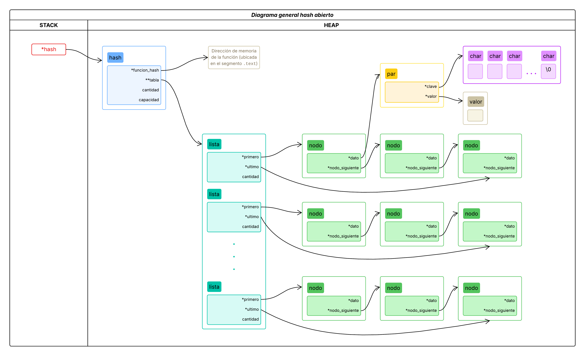

# TDA HASH

- **Alumno:** [Avril Victoria Morfeo Zerbi](https://github.com/AvrilMZ) 
- **Legajo:** 112563 
- **Mail:** amorfeo@fi.uba.ar


### Instrucciones para correr el proyecto:

- Para compilar las pruebas:
```bash
make pruebas_alumno
```

- Para ejecutar las pruebas:
```bash
./pruebas_alumno
```

- Para ejecutar con Valgrind:
```bash
make valgrind-alumno
```

<br>

## Funcionamiento
<div style="text-align: justify">

El programa implementa una **tabla de hash** que permite almacenar pares clave-valor, donde las claves son strings únicos utilizados para acceder a los valores asociados. La tabla de hash usa una función de hash para mapear estas claves a índices dentro de un arreglo, lo que permite un acceso rápido.

Una **función de hash** es una función que toma una clave como entrada y devuelve un número entero, que representa un índice dentro del arreglo. La función de hash debe ser determinística, eficiente, poder distribuir uniformemente las claves posibles y minimizar la cantidad de colisiones.

En caso de colisiones, se pueden usar dos métodos de resolución:
- **Encadenamiento (hash abierto)**: se almacenan múltiples elementos en una misma posición de la tabla usando una lista enlazada, árbol binario u otra estructura de datos dinámica. Esto permite manejar colisiones sin necesidad de encontrar una nueva posición en el arreglo o usar una flag para indicar si una posición fue eliminada.  
Aun así, cuando hay muchas colisiones y las listas empiezan a crecer mucho, conviene hacer un rehash para mantener la eficiencia.
- **Direccionamiento abierto (hash cerrado)**: en caso de una colisión, se busca otra posición libre en el arreglo para almacenar el nuevo elemento, según un método de probing, como lineal, cuadrático o hash doble.  
Este método depende de tener espacio libre en la tabla. Por eso, cuando se supera cierto factor de carga, se hace rehash.

</div>

<div id="imagen1" align="center">
	

<sup>Figura 1. Ejemplo de implementación de una tabla de hash abierta (encadenamiento).</sup>
</div>

<div>

En este trabajo se implementó una tabla de hash con direccionamiento abierto, utilizando los siguientes campos:
- `capacidad`: Cantidad de posiciones que tiene la tabla.
- `cantidad`: Cantidad de elementos que tiene la tabla.
- `tabla`: Arreglo de elementos de tipo `par_t`, que contiene la clave, el valor y un booleano que indica si la posición fue eliminada.
- `funcion_hash`: Función de hash que se utiliza para mapear las claves a índices en la tabla.

</div>

<div id="imagen2" align="center">
	

<sup>Figura 2. Ejemplo de implementación de una tabla de hash cerrada (direccionamiento abierto).</sup>
</div>

<div>

Se implementaron las siguientes primitivas:
- `hash_crear()`: Crea una tabla de hash con una capacidad dada, en caso de ser menor a la capacidad mínima se ajusta a esta. Se utiliza la función de hash [DJB2](#imagen3) para mapear las claves a índices en la tabla.
	- Complejidad: $O(1)$ en tiempo y $`O(1)`$ en espacio.
- `hash_crear_con_funcion()`: Crea una tabla de hash con una capacidad dada, en caso de ser menor a la capacidad mínima se ajusta a esta, además permite especificar una función de hash personalizada, en caso de no especificarse se utiliza la función de hash DJB2.
	- Complejidad: $O(1)$ en tiempo y $`O(1)`$ en espacio.
- [`hash_insertar()`](#imagen4): Devuelve true si se insertó un par clave-valor en la tabla de hash. Si la clave ya existe, se actualiza el valor y en caso de pasarle un puntero al valor anterior se actualiza. Si la tabla supera el factor de carga máximo, se rehasha la tabla.
	- Complejidad: En promedio, el tiempo es $O(1)$, pero si el factor de carga es muy alto o la función hash es ineficiente y genera muchas colisiones, puede resultar en $O(n)$, siendo $n$ la cantidad de elementos en la tabla. La complejidad en espacio es $O(1)$.
	- `rehash()`: Redimensiona la tabla de hash al doble de su capacidad actual, reubicando todos los elementos previos en la nueva posición dada por la función de hash.
		- Complejidad: $O(n)$ en tiempo, siendo $n$ la cantidad de elementos en la tabla anterior, y $O(1)$ en espacio.
- [`hash_sacar()`](#imagen5): Elimina y devuelve un elemento de la tabla de hash dado su clave. Si la clave no existe, devuelve NULL.
	- Complejidad: En promedio, el tiempo es $O(1)$, pero si la función hash es ineficiente y genera muchas colisiones, puede resultar en $O(n)$, siendo $n$ la cantidad de elementos en la tabla. Si bien se utiliza una flag para determinar si un elemento fue eliminado o no, evitando así la reubicación de los elementos siguientes, la búsqueda de la clave sigue siendo secuencial debido al probing lineal. La complejidad en espacio es $O(1)$.
- [`hash_buscar()`](#imagen6): Busca y devuelve el valor asociado a una clave en la tabla de hash. Si la clave no existe, devuelve NULL.
	- Complejidad: En promedio, el tiempo es $O(1)$, pero si el factor de carga es muy alto o la función hash es ineficiente y genera muchas colisiones, puede resultar en $O(n)$, siendo $n$ la cantidad de elementos en la tabla. La complejidad en espacio es $O(1)$.
- `hash_existe()`: Devuelve true si la clave existe en la tabla de hash, false en caso contrario.
	- Complejidad: En promedio, el tiempo es $O(1)$, pero si el factor de carga es muy alto o la función hash es ineficiente y genera muchas colisiones, puede resultar en $O(n)$, siendo $n$ la cantidad de elementos en la tabla. La complejidad en espacio es $O(1)$.
- `hash_tamanio()`: Devuelve la cantidad de elementos en la tabla de hash.
	- Complejidad: $O(1)$ en tiempo y $`O(1)`$ en espacio.
- `hash_iterar_claves()`: Itera sobre las claves de la tabla de hash y aplica una función a cada clave. Devuelve la cantidad de claves iteradas.
	- Complejidad: $O(n)$ en tiempo, siendo $n$ la cantidad de elementos en la tabla, y $O(1)$ en espacio.
- `hash_destruir()`: Libera la memoria utilizada por la tabla de hash y sus elementos sin tocar los valores.
	- Complejidad: $O(n)$ en tiempo, siendo $n$ la cantidad de elementos en la tabla, y $O(1)$ en espacio.
- `hash_destruir_todo()`: Libera la memoria utilizada por la tabla de hash y sus elementos. Si se pasa un puntero a una función de destrucción, se aplica a cada valor antes de liberar la memoria.
	- Complejidad: $O(n)$ en tiempo, siendo $n$ la cantidad de elementos en la tabla, y $O(1)$ en espacio.

</div>

<div id="imagen3" align="center">
	

<sup>Figura 3. Diagrama de flujo del algoritmo DJB2.</sup>
</div>

<div id="imagen4" align="center">
	

<sup>Figura 4. Ejemplo de implementación de la función hash_insertar().</sup>
</div>

<div id="imagen5" align="center">
	

<sup>Figura 5. Ejemplo de implementación de la función hash_sacar().</sup>
</div>

<div id="imagen6" align="center">
	

<sup>Figura 6. Ejemplo de implementación de la función hash_buscar().</sup>
</div>

## Conceptos teóricos
<div style="text-align: justify">

### Diccionarios
Un **diccionario** es una estructura de datos que permite almacenar pares clave-valor, donde las claves son únicas y se utilizan para acceder a los valores asociados. Existen varias formas de implementar un diccionario, entre ellas:
- **Tabla de hash**: Utiliza una función de hash para mapear las claves a índices en un arreglo.
- **Árbol binario de búsqueda**: Almacena los pares clave-valor en un árbol, donde las claves se organizan de manera que los elementos del subárbol izquierdo son menores que los del subárbol derecho.
- **Lista enlazada**: Almacena los pares clave-valor en una lista, donde cada nodo contiene una clave y un valor.

#### Ventajas y desventajas
- Tabla de hash: 
	- Ventajas: Acceso rápido a los valores, en promedio $O(1)$.
	- Desventajas: Puede requerir un mayor tamaño de tabla para evitar demasiadas colisiones, la función de hash debe ser bien diseñada para que la complejidad no resulte en $O(n)$.
- Árbol binario de búsqueda:
	- Ventajas: Permite búsquedas eficientes en tiempo $O(log(n))$.
	- Desventajas: En promedio es menos eficiente que una tabla de hash en tiempo y requiere estar balanceado para mantener la eficiencia y no resultar en $O(n)$, además de que en caso de estar implementado recursivamente puede generar un stack overflow si el árbol es muy grande.
- Lista enlazada: 
	- Ventajas: Implementación simple.
	- Desventajas: Búsquedas menos eficientes en tiempo, $O(n)$.

</div>

<div id="imagen7" align="center">
	

<sup>Figura 7. Ejemplo de implementación de un diccionario utilizando un árbol binario de búsqueda (ABB).</sup>
</div>

<div id="imagen8" align="center">
	

<sup>Figura 8. Ejemplo de implementación de un diccionario utilizando una lista enlazada.</sup>
</div>