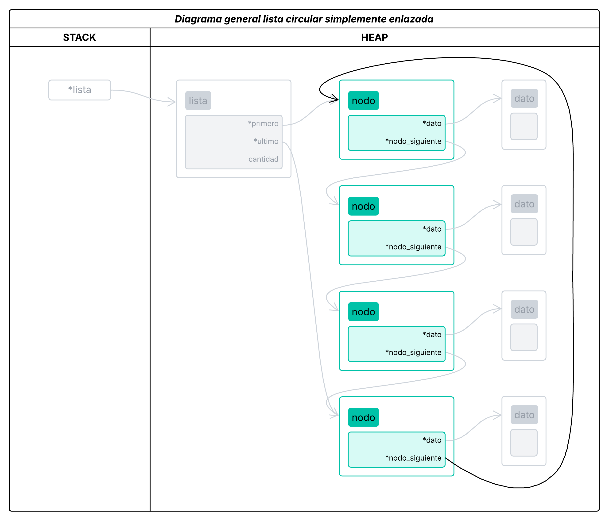

# TDA Lista, Pila y Cola

- **Alumno:** [Avril Victoria Morfeo Zerbi](https://github.com/AvrilMZ) 
- **Legajo:** 112563 
- **Mail:** amorfeo@fi.uba.ar


### Instrucciones para correr el proyecto:

- Para compilar:
```bash
make main
```

- Para ejecutar:
```bash
./main
```

- Para ejecutar con Valgrind:
```bash
valgrind --leak-check=full --track-origins=yes --show-reachable=yes --error-exitcode=2 --show-leak-kinds=all --trace-children=yes -s ./main
```

<br>

##  Funcionamiento
<div style="text-align: justify">

El programa implementa tres estructuras de datos: una lista simplemente enlazada, una pila (LIFO) y una cola (FIFO). La lista, que sirve de base para las otras dos, se representa mediante una estructura que incluye un puntero al primer nodo, otro al último, y un contador de elementos. Cada nodo contiene un puntero a sus datos y otro al siguiente nodo.

<div align="center">
	
</div>

### Lista simplemente enlazada
<div style="text-align: justify">

Una **lista** es una estructura de datos que almacena elementos en un orden específico, permitiendo la inserción, eliminación y acceso a elementos según su posición relativa. A diferencia de los arreglos, no requiere un tamaño fijo y gestiona la memoria de manera dinámica. Sin embargo, el acceso a los elementos de una lista generalmente se realiza de forma secuencial, lo que hace que la búsqueda de un elemento por índice sea más lenta en comparación con los arreglos, donde el acceso directo por índice es rápido. Además, las listas pueden estar implementadas de varias maneras, lo que les otorga flexibilidad en la gestión de memoria.

Una **lista simplemente enlazada** es una implementación específica de una lista, donde cada elemento (nodo) contiene un valor y un puntero al siguiente nodo. Esto permite la inserción y eliminación de elementos de manera eficiente, ya que solo es necesario modificar los punteros de los nodos adyacentes. Sin embargo, como en otras listas, el acceso a un nodo específico es secuencial, lo que significa que se debe recorrer la lista desde el principio hasta encontrar el elemento deseado. En comparación con las listas que pueden estar implementadas con arreglos, la lista simplemente enlazada tiene la ventaja de no requerir una memoria contigua, lo que le otorga mayor flexibilidad. Sin embargo, cada nodo adicional requiere más memoria para almacenar el puntero al siguiente nodo, lo que aumenta el uso de memoria en comparación con un arreglo.

La lista simplemente enlazada fue implementada siguiendo las siguientes primitivas:
- `lista_crear()`: crea una lista simplemente enlazada vacía.
- `lista_insertar()`: inserta un elemento al final de la lista.
- `lista_insertar_en_posicion()`: inserta un elemento en una posición específica de la lista.
- `lista_tamanio()`: devuelve el tamaño de la lista.
- `lista_obtener_elemento()`: devuelve el elemento en una posición específica de la lista.
- `lista_sacar_de_posicion()`: saca un elemento de una posición específica de la lista.
- `lista_sacar_elemento()`: saca un elemento de la lista.
- `lista_buscar_posicion()`: busca un elemento en la lista y devuelve su posición.
- `lista_buscar()`: busca un elemento de la lista aplicando una función de comparación.
- `lista_iterar()`: itera sobre los elementos de la lista y aplica una función a cada elemento.
- `lista_destruir()`: destruye la lista y libera la memoria ocupada por los nodos y los datos.

</div>

<div align="center">
	
</div>

<div align="center">
	
</div>

<div align="center">
	
	<sup>(El color gris representa lo eliminado)</sup>
</div>

<br>

<div style="text-align: justify">

Por otro lado se implementaron dos tipos de iteradores para la lista simplemente enlazada: un iterador interno y un iterador externo.

El **iterador interno** permite que la lista recorra automáticamente sus elementos. Esto significa que el proceso de iteración es gestionado por la propia lista, y el usuario no necesita interactuar con el ciclo de recorrido. El iterador interno facilita el uso de la lista, ya que el código que recorre los elementos está encapsulado en la estructura de la lista misma. En el caso de la lista simplemente enlazada, el iterador interno comenzaría desde el primer nodo y avanzaría automáticamente hasta el último, de acuerdo con la estructura de los punteros de los nodos.

En contraste, el **iterador externo** es diseñado para darle mayor control al usuario sobre el recorrido de la lista. A diferencia del iterador interno, el iterador externo permite al usuario manejar directamente cómo y cuándo recorrer los nodos. El usuario puede, por ejemplo, decidir en qué punto comenzar o terminar la iteración, o incluso interrumpirla en cualquier momento, por lo que proporciona flexibilidad y control explícito sobre el proceso de iteración.

Las principales diferencias entre estos dos tipos de iteradores radican en el control que tienen sobre el proceso de recorrido: el iterador interno se encarga de todo automáticamente, mientras que el iterador externo le permite al usuario gestionar y personalizar el recorrido de la lista. El iterador interno fue implementado con la función `lista_iterar()`, mientras que el iterador externo utiliza las funciones `lista_iterador_crear()`, `lista_iterador_quedan_elementos_por_recorrer()`, etc.

El iterador externo fue implementado usando las siguientes primitivas:
- `lista_iterador_crear()`: crea un iterador externo para la lista.
- `lista_iterador_quedan_elementos_por_recorrer()`: verifica si quedan elementos por recorrer.
- `lista_iterador_proxima_iteracion()`: devuelve el siguiente elemento en la iteración.
- `lista_iterador_obtener_elemento()`: devuelve el elemento actual en la iteración.
- `lista_iterador_destruir()`: destruye el iterador externo y libera la memoria ocupada por el iterador.

</div>

### Pila
<div style="text-align: justify">

Una pila es una estructura de datos lineal que sigue el principio LIFO (Last In, First Out), es decir, el último elemento en ingresar es el primero en salir. En este caso fue implementada utilizando una lista simplemente enlazada, aprovechando la eficiencia de insertar y eliminar elementos al inicio de la lista. Esta decisión simplifica la implementación, ya que permite que tanto la operación de apilar como la de desapilar se realicen en tiempo constante, sin necesidad de recorrer la lista.

La pila fue implementada siguiendo las siguientes primitivas:
- `pila_crear()`: crea una pila vacía.
- `pila_apilar()`: apila un elemento en la pila.
- `pila_desapilar()`: desapila un elemento de la pila.
- `pila_tamanio()`: devuelve el tamaño de la pila.
- `pila_tope()`: devuelve el elemento en el tope de la pila.
- `pila_destruir()`: destruye la pila y libera la memoria ocupada por los nodos y los datos.

</div>

### Cola
<div style="text-align: justify">

Una cola es una estructura de datos lineal que sigue el principio FIFO (First In, First Out), donde el primer elemento en ingresar es el primero en salir. En este caso fue implementada utilizando una lista simplemente enlazada, manteniendo referencias al primer y último nodo para permitir inserciones al final y eliminaciones al inicio de manera eficiente. A diferencia de la pila, que opera sobre un único extremo de la lista y sigue una lógica LIFO, la cola requiere operar en ambos extremos para preservar el orden de llegada. Esta diferencia hace que la pila sea más adecuada para contextos donde se necesita retroceder o deshacer acciones, mientras que la cola es útil para procesar elementos en el mismo orden en que fueron agregados, como en colas de impresión o gestión de tareas.

La cola fue implementada siguiendo las siguientes primitivas:
- `cola_crear()`: crea una cola vacía.
- `cola_encolar()`: encola un elemento en la cola.
- `cola_desencolar()`: desencola un elemento de la cola.
- `cola_tamanio()`: devuelve el tamaño de la cola.
- `cola_frente()`: devuelve el elemento en el frente de la cola.
- `cola_destruir()`: destruye la cola y libera la memoria ocupada por los nodos y los datos.

</div>

<br>

##  Conceptos teoricos
<div style="text-align: justify">

Hay algunos conceptos, que si bien no fueron implementados en este trabajo practico, son de alta relevancia mencionar.

</div>

### Lista doblemente enlazada
<div style="text-align: justify">

Una lista doblemente enlazada es una variante de la lista enlazada en la que cada nodo contiene dos punteros: uno que apunta al siguiente nodo y otro que apunta al nodo anterior. Esto permite recorrer la lista en ambas direcciones, lo que la hace más flexible que una lista simplemente enlazada. A pesar de esta ventaja, la lista doblemente enlazada utiliza más memoria por nodo, ya que debe almacenar dos punteros en lugar de uno, lo que incrementa el uso de memoria en comparación con las listas simplemente enlazadas. Las operaciones de inserción y eliminación son más eficientes en cualquier lugar de la lista, ya que se puede acceder al nodo anterior de manera inmediata, sin necesidad de recorrer la lista desde el principio.

</div>

<div align="center">
	
	<sup>(El color gris representa la implementación de una lista enlazada previamente explicada)</sup>
</div>


### Lista circular
<div style="text-align: justify">

Una lista circular es una lista donde el último nodo está conectado de nuevo al primero, creando un ciclo. Esto se aplica tanto a las listas simplemente enlazadas como a las doblemente enlazadas, generando una estructura donde, al llegar al final de la lista, se puede volver al inicio sin necesidad de verificar si se ha llegado al final. En una lista circular simplemente enlazada, el último nodo apunta al primer nodo, mientras que en una lista circular doblemente enlazada, el primer nodo apunta al último y el último nodo apunta al primero. La principal ventaja de las listas circulares es que no es necesario realizar verificaciones adicionales para determinar el fin de la lista, lo que puede simplificar algunas operaciones, como la inserción y eliminación de nodos en una estructura cíclica.

</div>

<div align="center">
	
	<sup>(El color gris representa la implementación de una lista simplemente enlazada previamente explicada)</sup>
</div>

<div align="center">
	
	<sup>(El color gris representa la implementación de una lista doblemente enlazada previamente explicada)</sup>
</div>