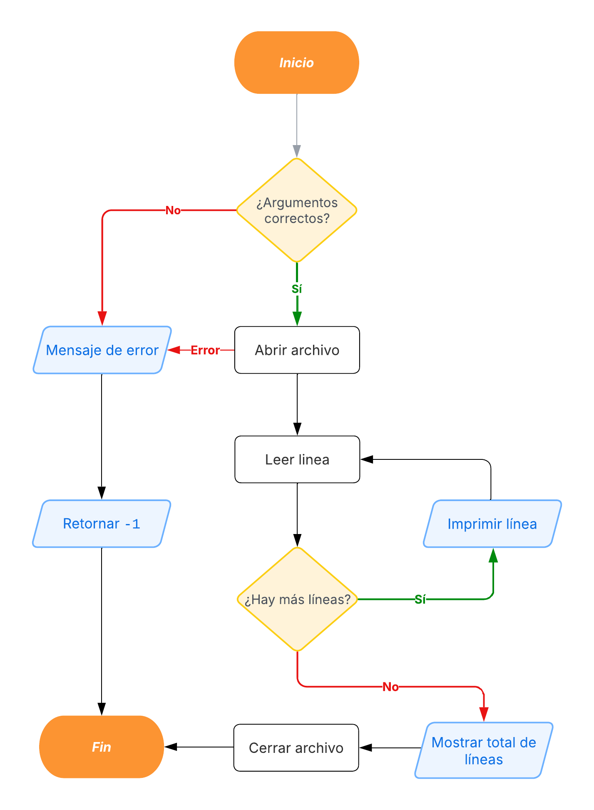

# TP0 - Lectura de archivos de texto

- **Alumno:** [Avril Victoria Morfeo Zerbi](https://github.com/AvrilMZ) 
- **Legajo:** 112563 
- **Mail:** amorfeo@fi.uba.ar


### Instrucciones para correr el proyecto:

- Para compilar:
```bash
gcc src/archivo.c ejemplo.c -o tp0
```

- Para ejecutar:
```bash
./tp0 <nombre_archivo>
```

- Para ejecutar con Valgrind:
```bash
valgrind ./tp0 <nombre_archivo>
```


##  Funcionamiento
El programa comienza verificando los argumentos proporcionados en la línea de comandos. Se comprueba si se ha pasado el nombre de un archivo como argumento. En caso de que no se proporcione, se muestra un mensaje de error y el programa finaliza inmediatamente.

A continuación, se intenta abrir el archivo llamando a la función `archivo_abrir()`. Si el archivo no se puede abrir, se imprime un mensaje de error y el programa termina sin continuar con el resto de las operaciones. Si la apertura es exitosa, el programa procede con la lectura del contenido del archivo.

El siguiente paso es la lectura de líneas del archivo. Se inicia un bucle for que se ejecuta mientras `archivo_hay_mas_lineas()` devuelva 1, lo que indica que aún quedan líneas por leer. En cada iteración del bucle, se llama a `archivo_leer_linea()` para obtener la siguiente línea disponible. La línea obtenida se imprime en la salida estándar junto con su número de línea, lo que permite visualizar el contenido del archivo procesado de manera ordenada.

Después de finalizar la lectura, el programa imprime la cantidad total de líneas leídas. Para esto, se invoca la función `archivo_lineas_leidas()`, la cual devuelve el número de líneas que han sido procesadas hasta el momento. Esta información se muestra en la salida estándar antes de proceder al cierre del archivo.

Finalmente, se llama a la función `archivo_cerrar()`, la cual libera toda la memoria reservada y cierra correctamente el archivo abierto. Una vez que se ha completado esta operación, el programa retorna 0, indicando que se ha ejecutado correctamente y ha finalizado sin errores.

<div align="center">
	
</div>


###  Funciones implementadas en el módulo `archivo.c`:

#### `archivo_abrir()`
Es responsable de abrir un archivo de texto en modo lectura y devolver un puntero a una estructura `Archivo`. Para lograr esto, primero se reserva memoria para la estructura `Archivo`. Luego, se intenta abrir el archivo utilizando `fopen()`. Si esta operación falla, se libera la memoria previamente reservada y se retorna `NULL` como indicación de error. En caso de éxito, se inicializan los valores de la estructura, estableciendo `lineas_leidas` en `0` y `ultima_linea` en `NULL`, y finalmente se devuelve el puntero a la estructura `Archivo`.

<div align="center">
	
</div>


#### `archivo_leer_linea()`
Permite leer una línea del archivo y devolverla en forma de cadena de caracteres. Antes de leer una nueva línea, se libera la memoria de la última línea almacenada, en caso de existir. Se reserva una cantidad inicial de memoria para la línea a leer y, mediante un bucle que emplea `fgetc()`, se van obteniendo caracteres del archivo hasta encontrar un salto de línea (`\n`) o el final del archivo (`EOF`). En caso de que la línea supere la memoria asignada, se realoca más espacio dinámicamente en una cantidad constante de 10 bytes. Una vez completada la lectura, la línea obtenida se almacena en `ultima_linea` y se incrementa el contador de líneas leídas. Finalmente, la función retorna la línea leída o `NULL` si no hay más contenido en el archivo.

<div align="center">
	
</div>


#### `archivo_hay_mas_lineas()`
Permite determinar si quedan más líneas por leer en el archivo. Para ello, se obtiene la posición actual del archivo utilizando `ftell()`. A continuación, se lee un carácter con `fgetc()` para verificar si hay más contenido disponible. Si el carácter obtenido es `EOF`, se concluye que no quedan más líneas y se devuelve `0`. En caso contrario, se retorna `1` y se restablece la posición original del archivo con `fseek()` para no alterar el flujo de lectura.

<div align="center">
	
</div>


#### `archivo_lineas_leidas()`
Proporciona la cantidad de líneas que han sido leídas hasta el momento. Si el archivo recibido como parámetro es `NULL`, la función retorna `0`. De lo contrario, se devuelve el valor almacenado en `lineas_leidas` dentro de la estructura `Archivo`, lo que permite obtener un seguimiento de la cantidad de líneas procesadas.

<div align="center">
	
</div>


#### `archivo_cerrar()`
Se encarga de cerrar el archivo y liberar toda la memoria reservada. Si el puntero archivo no es `NULL`, se procede a cerrar el archivo utilizando `fclose()` en caso de que estuviera abierto. También se libera la memoria de la última línea almacenada, si existía, y finalmente se libera la estructura `Archivo`.

<div align="center">
	
</div>