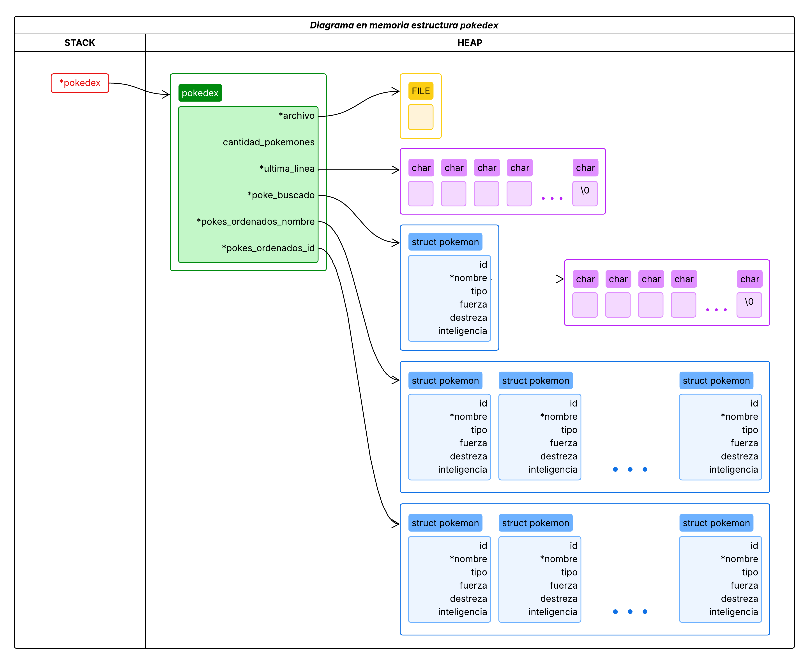
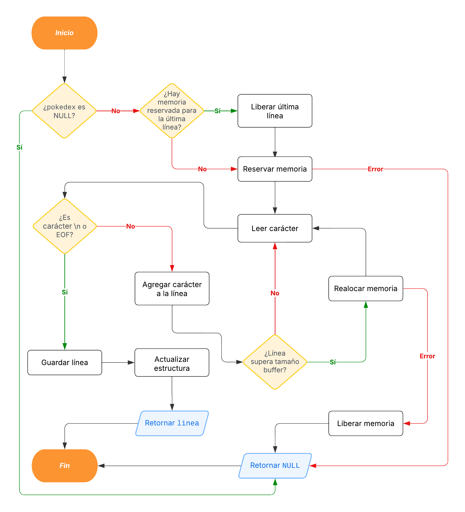
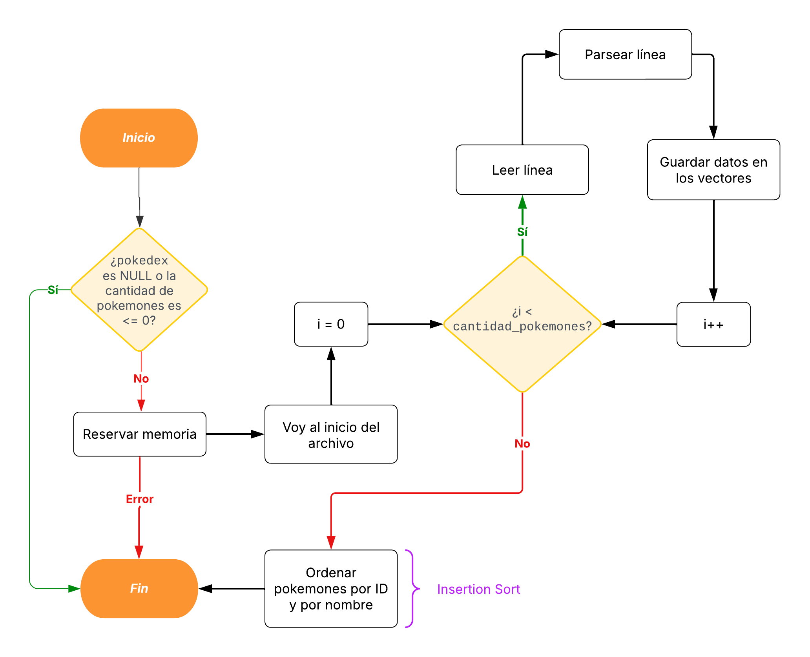
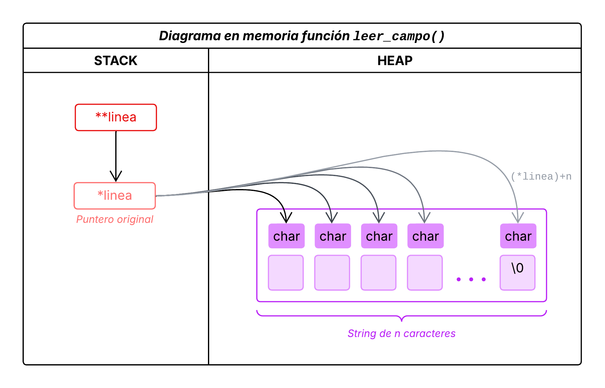

# TP1: Archivos, strings y muchos punteros

- **Alumno:** [Avril Victoria Morfeo Zerbi](https://github.com/AvrilMZ) 
- **Legajo:** 112563 
- **Mail:** amorfeo@fi.uba.ar


### Instrucciones para correr el proyecto:

- Para compilar:
```bash
gcc -std=c99 -Wall -Wconversion -Wtype-limits -pedantic -Werror -O2 -g src/pokedex.c tp1.c -o tp1
```

- Para ejecutar:
```bash
./tp1 <nombre_archivo> <accion_a_realizar>
```

- Para ejecutar con Valgrind:
```bash
valgrind --leak-check=full --track-origins=yes --show-reachable=yes --error-exitcode=2 --show-leak-kinds=all --trace-children=yes -s ./tp1 <nombre_archivo> <accion_a_realizar>
```

- Listado de acciones posibles a realizar:
```bash
./tp1 <nombre_archivo> mostrar nombre
./tp1 <nombre_archivo> mostrar id
./tp1 <nombre_archivo> buscar nombre <nombre_pokemon>
./tp1 <nombre_archivo> buscar id <id_pokemon>
./tp1 <nombre_archivo> buscar tipo <tipo_pokemon>
```

<br>

##  Funcionamiento
<div style="text-align: justify">

El programa implementa una pokédex que permite gestionar y consultar información sobre pokémons a partir de un archivo en formato CSV. El archivo debe contener datos de pokémons, donde cada línea representa un pokémon siguendo el formato `id;nombre;tipo;fuerza;destreza;inteligencia`.

Entre sus principales funcionalidades, el programa permite la búsqueda de pokémons según tres criterios: por ID, por nombre y por tipo. También ofrece la opción de listar todos los pokémon almacenados, permitiendo ordenarlos por nombre o por ID.

Se utiliza principalmente una estructura de datos `struct pokedex` que contiene los siguientes campos:
- `archivo`: puntero al archivo CSV.
- `cantidad_pokemones`: entero que representa la cantidad de pokémons válidos.
- `ultima_linea`: string que almacena la última línea leída del archivo.
- `poke_buscado`: puntero a un `struct pokemon` que almacena el pokémon buscado, ya sea por nombre o por ID.
- `pokes_ordenados_nombre`: puntero a un arreglo de punteros a `struct pokemon`, que almacena los pokémons ordenados por nombre.
- `pokes_ordenados_id`: puntero a un arreglo de punteros a `struct pokemon`, que almacena los pokémons ordenados por ID.

</div>

<div align="center">
	
</div>

<br>

###  Funciones implementadas en el módulo `pokedex.c`:

### `pokedex_abrir()`
<div style="text-align: justify">

Se encarga de inicializar la estructura de datos `pokedex` abriendo el archivo CSV en modo lectura y verificando la validez de cada línea. Si se encuentra una línea inválida, la lectura se detiene y solo se contabilizan los datos previos. Una vez determinado la cantidad de pokémon válidos, recorre nuevamente el archivo para cargar los datos en dos arreglos distintos, ordenándolos mediante insertion sort: uno por ID (`pokes_ordenados_id`) y otro por nombre (`pokes_ordenados_nombre`). Finalmente, devuelve un puntero a la estructura o `NULL` si no se puede abrir el archivo o si el primer pokémon es inválido.

**Complejidad:**
- **Tiempo:** $`O(n^2)`$, donde $`n`$ es la cantidad de pokémons válidos. Durante su ejecución, se llaman funciones como `parsear_linea()`, que internamente usa `leer_campo()` con complejidad $`O(m)`$ debido a que lee $`m`$ caracteres, y `archivo_leer_linea()`, ambas con complejidad $`O(n)`$. Aunque, el uso de insertion sort para ordenar los pokémons por ID y nombre implica que los $`n`$ pokémons se recorran $`n`$ veces, por lo que $`n^2`$ se convierte en la cota superior de la función.
- **Espacio:** $`O(n)`$, donde $`n`$ es la cantidad de pokémons válidos. Se consigue esta complejidad debido a que dentro de la estructura `pokedex` se crean dos arreglos de $`n`$ elementos cada uno (`pokes_ordenados_id` y `pokes_ordenados_nombre`).

</div>

<div align="center">
	
</div>

<br>  

**`archivo_leer_linea():`**

<div align="center">
	
</div>

<br>  

**`cargar_pokemones_ordenados():`**

<div align="center">
	
</div>

<br>  

**`leer_campo():`**

Se utiliza un puntero doble con el objetivo de modificar directamente el valor del puntero original que apunta a la línea. Esto permite que la función avance el puntero a medida que lee caracteres y, al finalizar, lo deje posicionado justo después del campo leído. De esta manera, se puede mantener el estado de lectura entre múltiples llamadas a la función.

<div align="center">
	
</div>

### `pokedex_cantidad_pokemones()`
<div style="text-align: justify">

Retorna la cantidad de pokémons válidos almacenados en `pokedex`. Esta cantidad se establece en `pokedex_abrir()` y representa el número de líneas válidas encontradas antes de la primera línea inválida. Si `pokedex` no es válida o no tiene un archivo asociado, retorna 0.

**Complejidad:**
- **Tiempo:** $`O(1)`$, ya que solo se accede a un campo de la estructura.
- **Espacio:** $`O(1)`$, ya que no se utiliza espacio adicional.

</div>

<div align="center">
	
</div>


### `pokedex_buscar_pokemon_nombre()`
<div style="text-align: justify">

Busca un pokémon por nombre utilizando el algoritmo de búsqueda binaria sobre el arreglo de pokémons previamente ordenados por nombre (`pokes_ordenados_nombre`). Primero verifica que los parámetros sean válidos y libera la memoria de cualquier búsqueda anterior. Luego realiza la búsqueda binaria y, si encuentra un pokémon con el nombre solicitado, crea una copia de la estructura. Esta copia se almacena en el campo `poke_buscado` en `pokedex` y se devuelve como resultado de la función. En caso de no encontrar coincidencia o si ocurre algún error durante el proceso, retorna NULL. Se debe tener en cuenta que si hay múltiples pokémons con el mismo nombre, devolverá el primero que encuentre según el orden interno del arreglo.

**Complejidad:**
- **Tiempo:** $`O(log(n))`$, donde $`n`$ es la cantidad de pokémons válidos, debido al uso de búsqueda binaria en la función `busqueda_binaria_nombre()`.
- **Espacio:** $`O(1)`$, ya que solo se reserva memoria para una estructura pokémon y un string.

</div>

<div align="center">
	
</div>


### `pokedex_buscar_pokemon_id()`
<div style="text-align: justify">

Busca un pokémon por ID utilizando el algoritmo de búsqueda binaria sobre el arreglo de pokémons previamente ordenados por ID (`pokes_ordenados_id`). Primero verifica que los parámetros sean válidos y libera la memoria de cualquier búsqueda anterior. Luego realiza la búsqueda binaria y, si encuentra un pokémon con el ID solicitado, crea una copia de la estructura. Esta copia se almacena en el campo `poke_buscado` en `pokedex` y se devuelve como resultado de la función. En caso de no encontrar coincidencia o si ocurre algún error durante el proceso, retorna NULL. Se debe tener en cuenta que si hay múltiples pokémons con el mismo ID, devolverá el primero que encuentre según el orden interno del arreglo.

**Complejidad:**
- **Tiempo:** $`O(log(n))`$, donde $`n`$ es la cantidad de pokémons válidos, debido al uso de búsqueda binaria en la función `busqueda_binaria_id()`.
- **Espacio:** $`O(1)`$, ya que solo se reserva memoria para una estructura pokémon y un string.

</div>

<div align="center">
	
</div>


### `pokedex_iterar_pokemones()`
<div style="text-align: justify">

Permite recorrer secuencialmente el conjunto de pokémons almacenados, ya sea ordenados por ID o por nombre según el modo indicado. Para cada pokémon, crea una copia de su nombre y ejecuta la función callback proporcionada por el usuario, pasándole el pokémon actual y un contexto. La iteración continúa mientras la función callback retorne true y queden elementos por recorrer. Finalmente devuelve el número total de pokémons procesados durante la iteración, o 0 si algún parámetro es inválido o no hay pokémons.

**Complejidad:**
- **Tiempo:** $`O(n)`$, donde $`n`$ es la cantidad de pokémons válidos. Esta complejidad se debe a que en el peor caso recorre todos los elementos mediante un bucle for.
- **Espacio:** $`O(1)`$, ya que solo requiere memoria para duplicar un nombre a la vez mediante la función `duplicar_string()`. Esta memoria se libera tras cada iteración, por lo que el espacio utilizado no crece con la cantidad de elementos.

</div>

<div align="center">
	
</div>


### `pokedex_destruir()`
<div style="text-align: justify">

Libera completamente todos los recursos asociados a una estructura de datos `pokedex`.

**Complejidad:**
- **Tiempo:** $`O(n)`$, donde $`n`$ es la cantidad de pokémons válidos, debido a la tener que liberar individualmente cada nombre duplicado en los vectores `pokes_ordenados_nombre` y `pokes_ordenados_id`.
- **Espacio:** $`O(1)`$, ya que no se utiliza espacio adicional.

</div>

<div align="center">
	
</div>
