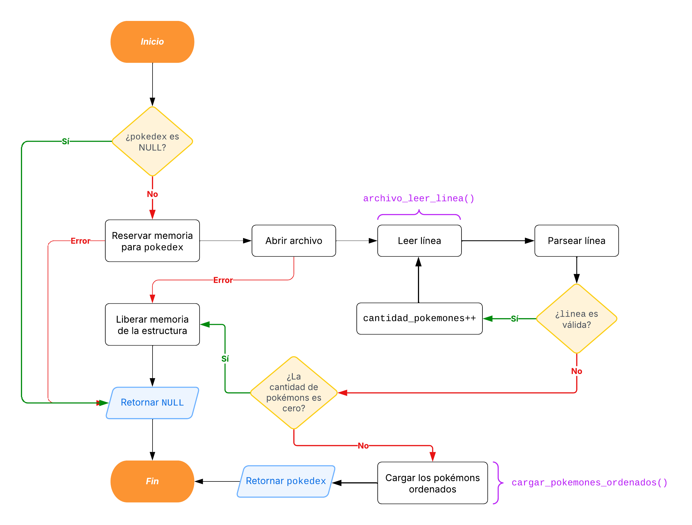
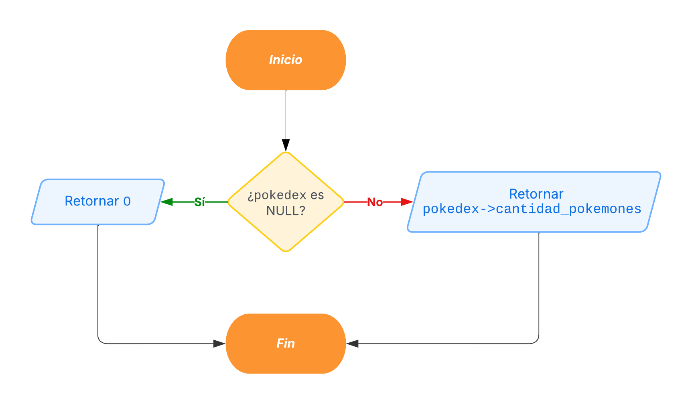
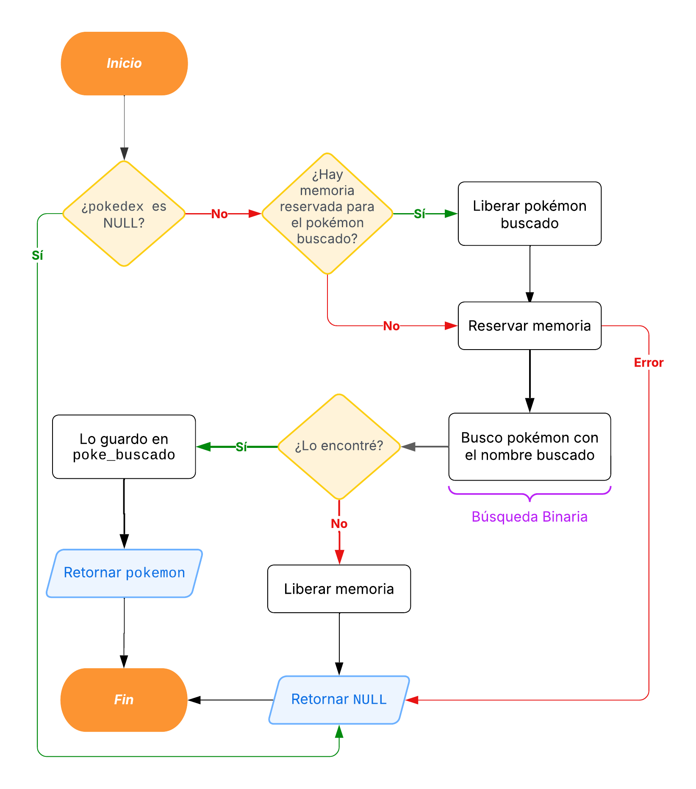
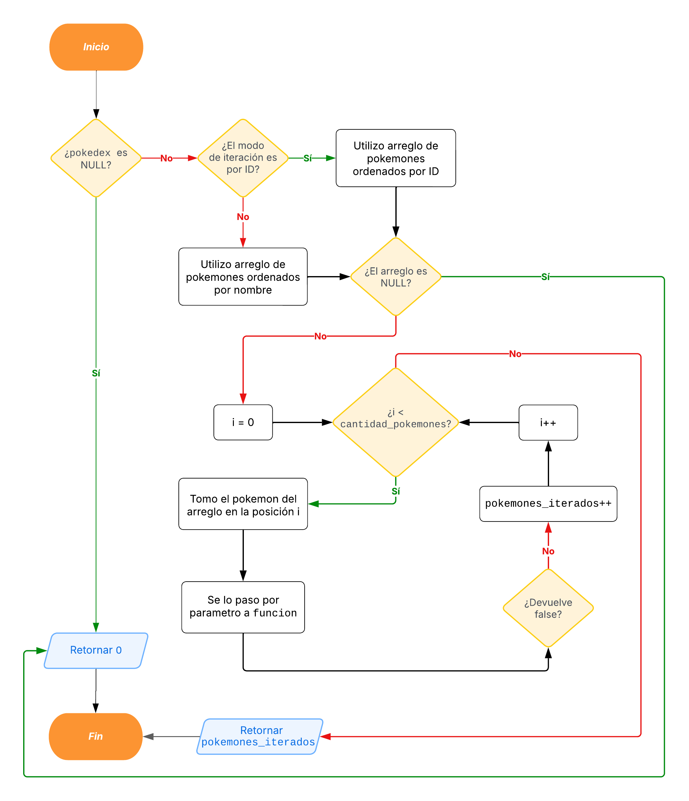
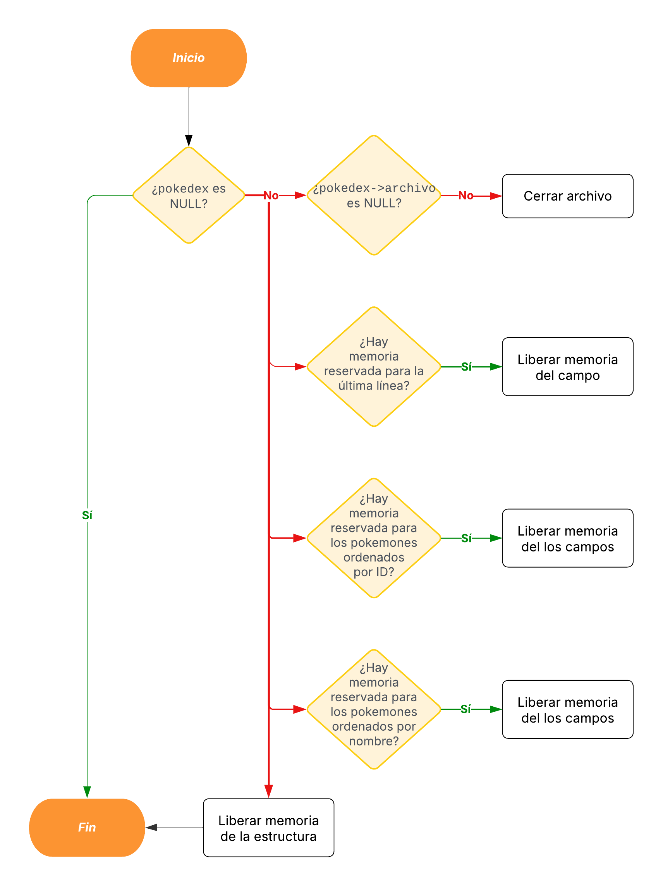

# TP1: Archivos, strings y muchos punteros

- **Alumno:** [Avril Victoria Morfeo Zerbi](https://github.com/AvrilMZ) 
- **Legajo:** 112563 
- **Mail:** amorfeo@fi.uba.ar


### Instrucciones para correr el proyecto:

- Para compilar:
```bash
gcc -std=c99 -Wall -Wconversion -Wtype-limits -pedantic -Werror -O2 -g src/pokedex.c tp1.c -o tp1
```

- Para ejecutar:
```bash
./tp1 <nombre_archivo> <accion_a_realizar>
```

- Para ejecutar con Valgrind:
```bash
valgrind --leak-check=full --track-origins=yes --show-reachable=yes --error-exitcode=2 --show-leak-kinds=all --trace-children=yes -s ./tp1 <nombre_archivo> <accion_a_realizar>
```

<br>

##  Funcionamiento
<div style="text-align: justify">

El programa implementa una pokédex que permite gestionar y consultar información sobre pokémons a partir de un archivo en formato CSV. El archivo debe contener datos de pokémons, donde cada línea representa un pokémon siguendo el formato `id;nombre;tipo;fuerza;destreza;inteligencia`.

Entre sus principales funcionalidades, el programa permite la búsqueda de pokémons según tres criterios: por ID, por nombre y por tipo. También ofrece la opción de listar todos los pokémon almacenados, permitiendo ordenarlos por nombre o por ID.

Se utiliza principalmente una estructura de datos `struct pokedex` que contiene los siguientes campos:
- `archivo`: puntero al archivo CSV.
- `cantidad_pokemones`: entero que representa la cantidad de pokémons válidos.
- `ultima_linea`: string que almacena la última línea leída del archivo.
- `poke_buscado`: puntero a un `struct pokemon` que almacena el pokémon buscado, ya sea por nombre o por ID.
- `pokes_ordenados_nombre`: puntero a un arreglo de punteros a `struct pokemon`, que almacena los pokémons ordenados por nombre.
- `pokes_ordenados_id`: puntero a un arreglo de punteros a `struct pokemon`, que almacena los pokémons ordenados por ID.

</div>

<div align="center">
	
</div>

<br>

###  Funciones implementadas en el módulo `pokedex.c`:

#### `pokedex_abrir()`
<div style="text-align: justify">

Se encarga de inicializar la estructura de la pokédex abriendo el archivo en modo lectura y verificando la validez de cada línea. Si se encuentra una línea inválida, la lectura se detiene y solo se contabilizan los datos previos. Una vez determinado el número de líneas válidas (pokémons válidos), el archivo se recorre nuevamente para cargar la información en dos arreglos distintos: uno ordenado por ID y otro por nombre, utilizando insertion sort. Finalmente, devuelve un puntero a la estructura de la pokédex o `NULL` si no se puede abrir el archivo o si el primer pokémons es inválido.

**Complejidad:**
- **Tiempo:** O(n^2) en el peor de los casos, donde n es la cantidad de pokémons válidos.
- **Espacio:** O(n), donde n es la cantidad de pokémons válidos.

</div>

<div align="center">
	
</div>


#### `pokedex_cantidad_pokemones()`
<div style="text-align: justify">

Retorna el contador de pokémons que se estableció durante la apertura del archivo.

**Complejidad:**
- **Tiempo:** O(1), ya que solo se accede a un atributo de la estructura.
- **Espacio:** O(1), ya que no se utiliza espacio adicional.

</div>

<div align="center">
	
</div>


#### `pokedex_buscar_pokemon_nombre()`
<div style="text-align: justify">

Realiza una búsqueda secuencial en el archivo para localizar un pokémon cuyo nombre coincida con el parámetro recibido. Reinicia la lectura del archivo y, para cada línea válida, parsea el registro y compara el nombre. Si encuentra un pokémon con el nombre buscado, devuelve un puntero a la estructura del pokémon, en caso contrario devuelve `NULL`.

**Complejidad:**
- **Tiempo:** O(n), donde n es la cantidad de pokémons válidos.
- **Espacio:** O(1), ya que no se utiliza espacio adicional.

</div>

<div align="center">
	
</div>


#### `pokedex_buscar_pokemon_id()`
<div style="text-align: justify">

Realiza una búsqueda secuencial en el archivo para localizar un pokémon cuyo ID coincida con el parámetro recibido. Reinicia la lectura del archivo y, para cada línea válida, parsea el registro y compara el ID. Si encuentra un pokémon con el ID buscado, devuelve un puntero a la estructura del pokémon, en caso contrario devuelve `NULL`.

**Complejidad:**
- **Tiempo:** O(n), donde n es la cantidad de pokémons válidos.
- **Espacio:** O(1), ya que no se utiliza espacio adicional.

</div>

<div align="center">
	
</div>


#### `pokedex_iterar_pokemones()`
<div style="text-align: justify">

Permite recorrer de forma ordenada el arreglo de pokemones ya precargado, ya sea por ID o por nombre, según se indique. Para cada elemento, duplica temporalmente el string que contiene el nombre y ejecuta una función callback booleana proporcionada por el usuario, esta se detiene en cuanto el retorne false. Finalmente devuelve la cantidad de pokemones iterados.

**Complejidad:**
- **Tiempo:** O(n), donde n es la cantidad de pokémons válidos.
- **Espacio:** O(n), donde n es la cantidad de pokémons válidos, debido a la duplicación de strings.

</div>

<div align="center">
	
</div>


#### `pokedex_destruir()`
<div style="text-align: justify">

Se encarga de cerrar el archivo y liberar toda la memoria reservada.

**Complejidad:**
- **Tiempo:** O(n), donde n es la cantidad de pokémons válidos.
- **Espacio:** O(1), ya que no se utiliza espacio adicional.

</div>

<div align="center">
	
</div>