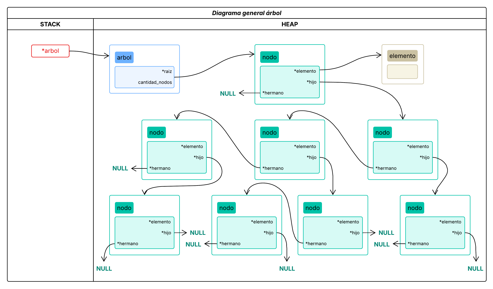
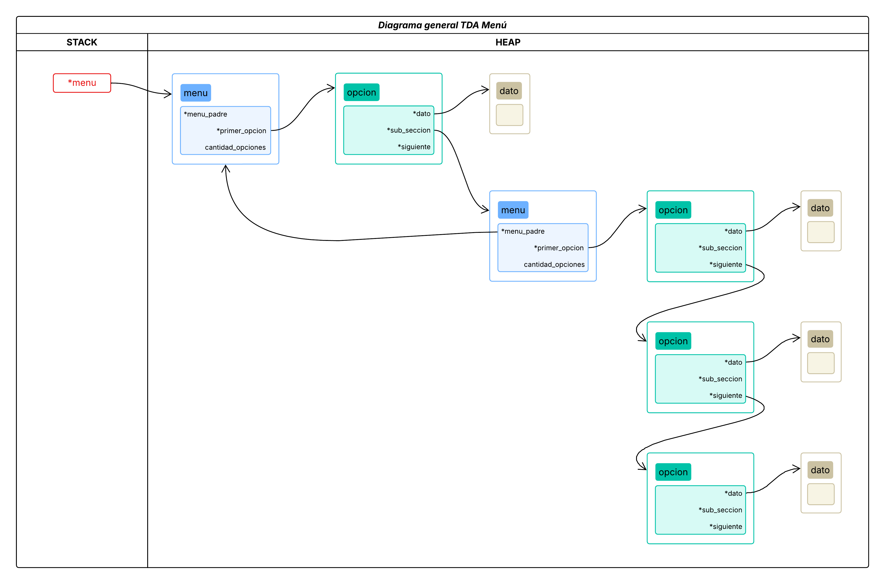
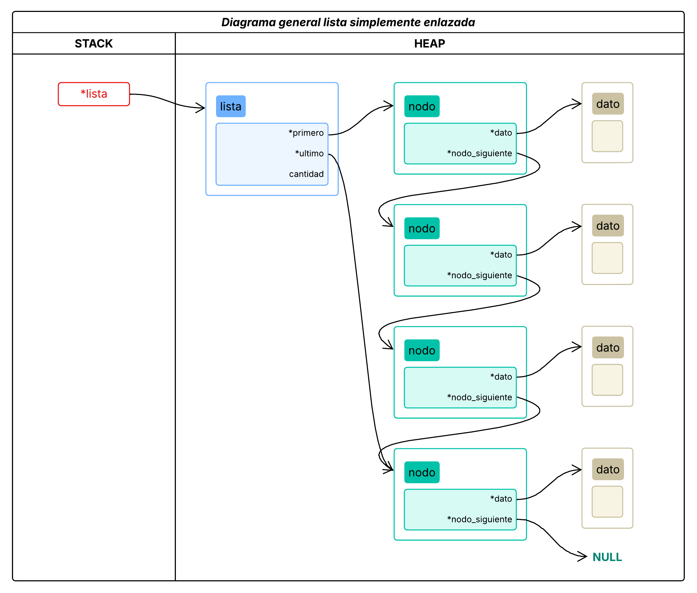
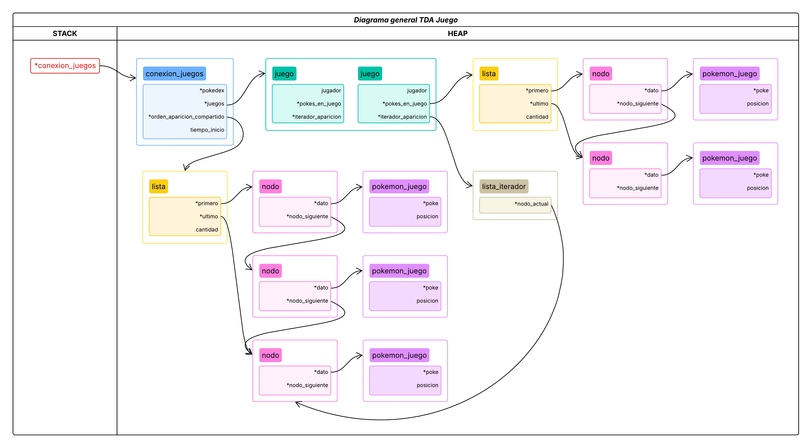

# TP2

- **Alumno:** [Avril Victoria Morfeo Zerbi](https://github.com/AvrilMZ) 
- **Legajo:** 112563 
- **Mail:** amorfeo@fi.uba.ar


### Instrucciones para correr el proyecto:

- Para compilar:
```bash
make tp2
```

- Para ejecutar:
```bash
./tp2 <archivo.csv>
```

- Para ejecutar con Valgrind:
```bash
make valgrind-tp2
```

<br>

## TDA Menú
<div style="text-align: justify">

Se planteó el [TDA Menú](#imagen2) como un árbol, donde cada nodo es una opción. Cada opción puede tener subsecciones (hijos), que a su vez pueden contener más opciones (hermanos). Esta decisión fue tomada ya que un [TDA árbol](#imagen1) contiene nodos que pueden tener múltiples hijos, lo que se asemeja a la estructura de un menú con opciones y subsecciones.

</div>

<div id="imagen1" align="center">
	

<sup>Figura 1. Ejemplo de implementación TDA árbol</sup>
</div>

<div style="text-align: justify">

En este caso, siguiendo la idea del árbol, se implementó la estructura `menu_t` con los siguientes campos:
- `menu_padre`: permite navegar hacia arriba en el árbol (volver a una sección anterior).
- `primer_opcion`: permite acceder a las opciones de la sección actual.
- `cantidad_opciones`: permite conocer la cantidad de opciones en la sección actual.

El campo `menu_padre` es de tipo `menu_t`, y el campo `primer_opcion` es de tipo `opcion_t`. La estructura `opcion_t` contiene:
- `sub_seccion`: permite acceder a las subsecciones de la opción actual.
- `siguiente`: permite acceder a la siguiente opción en la misma sección.
- `dato`: un puntero a un dato genérico que representa la opción.

</div>

<div id="imagen2" align="center">
	

<sup>Figura 2. Ejemplo de implementación TDA menú</sup>
</div>

<div style="text-align: justify">

Primitivas implementadas:
- `crear_menu()`: crea un menú vacío.
	- Complejidad: $O(1)$ en tiempo y $O(1)$ en espacio.
- `obtener_menu_padre()`: devuelve el menú padre del menú actual.
	- Complejidad: $O(1)$ en tiempo y $O(1)$ en espacio.
- `insertar_opcion_en_seccion()`: inserta una opción en la sección (`menu_t`) dada.
	- Complejidad: $O(1)$ en tiempo si la sección está vacía, $O(n)$ en tiempo si la sección ya tiene opciones, siendo $n$ la cantidad de opciones en la sección, y $O(1)$ en espacio.
- `eliminar_opcion_en_seccion()`: elimina la primera aparición de la opción usando un comparador personalizado.
	- Complejidad: $O(n)$ en tiempo, siendo $n$ la cantidad de opciones en la sección, y $O(1)$ en espacio.
- `existe_opcion_en_seccion()`: verifica si una opción existe en la sección dada usando un comparador personalizado.
	- Complejidad: $O(n)$ en tiempo, siendo $n$ la cantidad de opciones en la sección, y $O(1)$ en espacio.
- `obtener_subseccion_de_opcion()`: devuelve la subsección asociada a una opción específica, usando un comparador personalizado para encontrarla.
	- Complejidad: $O(n)$ en tiempo, siendo $n$ la cantidad de opciones en la sección, y $O(1)$ en espacio.
- `cantidad_opciones_seccion()`: devuelve la cantidad de opciones en la sección dada.
	- Complejidad: $O(1)$ en tiempo y $O(1)$ en espacio.
- `agregar_subseccion_a_opcion()`: agrega una subsección a una opción específica, usando un comparador personalizado para encontrarla.
	- Complejidad: $O(n)$ en tiempo, siendo $n$ la cantidad de opciones en la sección, y $O(1)$ en espacio.
- `menu_vacio()`: verifica si el menú está vacío.
	- Complejidad: $O(1)$ en tiempo y $O(1)$ en espacio.
- `destruir_menu()`: destruye el menú y libera la memoria asociada.
	- Complejidad: $O(n)$ en tiempo, siendo $n$ la cantidad de opciones en el menú, y $O(1)$ en espacio.

También se implementó un **iterador externo** con los campos:
- `menu`: puntero al menú que se está iterando.
- `actual`: puntero a la opción actual en el menú.
- `anterior`: puntero a la opción anterior en el menú.

Primitivas implementadas:
- `crear_iterador_menu()`: crea un iterador para el menú dado.
	- Complejidad: $O(1)$ en tiempo y $O(1)$ en espacio.
- `iterador_tiene_siguiente()`: verifica si el iterador tiene una opción siguiente.
	- Complejidad: $O(1)$ en tiempo y $O(1)$ en espacio.
- `iterador_siguiente()`: avanza al siguiente elemento del iterador.
	- Complejidad: $O(1)$ en tiempo y $O(1)$ en espacio.
- `iterador_obtener_subseccion_actual()`: devuelve la subsección asociada a la opción actual del iterador.
	- Complejidad: $O(1)$ en tiempo y $O(1)$ en espacio.
- `iterador_obtener_menu_padre()`: devuelve el menú padre del iterador.
	- Complejidad: $O(1)$ en tiempo y $O(1)$ en espacio.
- `iterador_reiniciar()`: reinicia el iterador al inicio del menú dado.
	- Complejidad: $O(1)$ en tiempo y $O(1)$ en espacio.
- `destruir_iterador_menu()`: destruye el iterador y libera la memoria asociada.
	- Complejidad: $O(1)$ en tiempo y $O(1)$ en espacio.

</div>

## TDA Juego
<div style="text-align: justify">

Este TDA implementa toda la lógica del juego solicitado, para lo cual se utilizó un [**TDA lista**](#imagen3) para almacenar los pokémones capturados individualmente y los próximos a aparecer en ambos juegos, y un **TDA pila**, implementado con una lista, para los pokémones pendientes a atrapar de cada jugador.

</div>

<div id="imagen3" align="center">
	

<sup>Figura 3. Ejemplo de implementación TDA lista simplemente enlazada</sup>
</div>

<div style="text-align: justify">

Inicialmente se pensó utilizar un TDA cola para los pokémones pendientes ya que en el momento de agregar un pokémon al juego se sacaría el primero y me permitiría anticiparme a que se vacíe, agregando una cantidad constante al final. Esto se descartó en el momento en que quise que ambos jugadores compartieran esta cola, ya que en el momento de agregar el pokémon al juego de uno se perdería la aparición para el otro jugador, a causa de que solo puedo interactuar con el inicio y fin de la misma. Por lo tanto, se eligió un TDA lista, donde cada jugador contiene su propio índice para así llevar un control independiente de qué pokémones les siguen apareciendo, asimismo la idea de ampliar el contenido a una cantidad constante se mantiene para mejorar la eficiencia del juego.

Luego para los pokémones capturados también se optó por usar una lista, ya que siempre se agregarían al final y sirve para recorrer buscando alguno en particular o simplemente mostrarlos.

Finalmente, para los pokémones pendientes a atrapar de cada jugador se usó un TDA pila, ya que siempre que el oponente atrapa un pokémon se le agrega al tope de la misma, y en el momento en que el jugador atrape un pokémon se elimina desde el tope, permitiendo que el jugador siempre tenga acceso al último pokémon pendiente a atrapar.

En cuanto a estructuras, se implementaron varias, con el objetivo de que quedaran lo más modularizado posible y así poder, en caso de desear, agregar más jugadores.

En primer lugar tenemos la estructura `coordenada_t` para manejar las posiciones en juego:
- `fil`: coordenada vertical.
- `col`: coordenada horizontal.

Luego tenemos la estructura `pokemon_juego_t` que representa a un pokémon en el juego:
- `poke`: puntero al pokémon (del tipo `struct pokemon` definido en `pokedex.h`).
- `posicion`: coordenada (`coordenada_t`) del pokémon en el juego.

Después tenemos la estructura `jugador_t` que representa a un jugador en el juego:
- `pokes_capturados`: lista de pokémones capturados por el jugador (`lista_t`).
- `pokes_pendientes`: pila de pokémones pendientes a atrapar por el jugador (`pila_t`).
- `posicion`: coordenada (`coordenada_t`) del jugador en el juego.
- `puntos`: puntos del jugador.

Seguimos con la estructura `juego_t` que representa un tablero de juego:
- `jugador`: jugador actual (`jugador_t`).
- `pokes_en_juego`: lista de pokémones en juego (`lista_t`).
- `indice_aparicion_actual`: índice actual en la lista compartida de pokémones a aparecer.

Por último, tenemos la estructura `conexion_juegos_t` que representa la conexión entre los juegos:
- `pokedex`: puntero a la pokedex con los pokémones disponibles.
- `juegos`: arreglo de juegos.
- `orden_aparicion_compartido`: lista de pokémones que van a aparecer en ambos juegos (`lista_t`).
- `tiempo_inicio`: tiempo de inicio del juego para la cuenta regresiva.

</div>

<div id="imagen4" align="center">
	

<sup>Figura 4. Ejemplo de implementación TDA juego</sup>
</div>

<div style="text-align: justify">

Primitivas implementadas:
- `inicializar_juego()`: inicializa el juego con la pokedex y semilla dada.
	- Complejidad: $O(n)$ en tiempo, siendo $n$ la cantidad de pokémones que se cargan al juego desde la pokedex, y $O(1)$ en espacio.
	- Para cargar los pokémones se utiliza una estructura auxiliar `aux_recolectar_pokes_t` para poder utilizar la función `pokedex_iterar_pokemones()` de `pokedex.h` logrando pasarle más de un dato por parámetro, y así poder cargar en la lista del campo `lista_pokes` una `cant_deseada`.
- `obtener_juego()`: obtiene el juego del índice dado de la conexión.
	- Complejidad: $O(1)$ en tiempo y $O(1)$ en espacio.
- `realizar_jugada()`: realiza el movimiento dado realizando las interacciones necesarias con el juego.
	- Complejidad: En el peor caso $O(n)$ en tiempo, siendo $n$ la cantidad de pokémones en juego, ya que se debe recorrer la lista de pokémones en juego para verificar si el jugador está en la misma posición que alguno de ellos, y $O(1)$ en espacio.
	- En esta función, al igual que `inicializar_juego()`, también se utiliza la estructura `aux_recolectar_pokes_t` para el caso en el que la lista `orden_aparicion_compartido` tenga una cantidad menor a la deseada y así poder redimensionarla agregando una cantidad constante de pokémones adicionales.
- `obtener_contenido_posicion()`: obtiene el contenido de la posición dada en el juego, en caso de que haya un pokémon devuelve la inicial del nombre o sino el carácter correspondiente al jugador.
	- Complejidad: $O(n)$ en tiempo, siendo $n$ la cantidad de pokémones en juego, ya que se debe recorrer la lista de pokémones en juego para verificar si hay alguno en la posición dada, y $O(1)$ en espacio.
- `obtener_pokemon_en_posicion()`: obtiene el pokémon en la posición dada en el juego, en caso de existir.
	- Complejidad: $O(n)$ en tiempo, siendo $n$ la cantidad de pokémones en juego, ya que se debe recorrer la lista de pokémones en juego para verificar si hay alguno en la posición dada, y $O(1)$ en espacio.
- `estado_juego()`: devuelve el estado del juego.
	- Complejidad: $O(1)$ en tiempo y $O(1)$ en espacio.
- `obtener_puntos_jugador()`: obtiene los puntos del jugador del juego dado.
	- Complejidad: $O(1)$ en tiempo y $O(1)$ en espacio.
- `obtener_cantidad_pokes_capturados()`: obtiene la cantidad de pokémones capturados por el jugador del juego dado.
	- Complejidad: $O(1)$ en tiempo y $O(1)$ en espacio.
- `obtener_pokemon_capturado()`: obtiene el pokémon de la lista de pokémones capturados en la posición dada del jugador del juego dado.
	- Complejidad: $O(n)$ en tiempo, siendo $n$ la cantidad de pokémones capturados por el jugador, y $O(1)$ en espacio.
- `recorrer_pokemones_capturados()`: recorre los pokémones capturados por el jugador del juego dado, aplicando una función a cada uno.
	- Complejidad: $O(n)$ en tiempo, siendo $n$ la cantidad de pokémones capturados por el jugador, y $O(1)$ en espacio.
- `obtener_cantidad_pokes_pendientes()`: obtiene la cantidad de pokémones pendientes del jugador del juego dado.
	- Complejidad: $O(1)$ en tiempo y $O(1)$ en espacio.
- `obtener_pokemon_pendiente_tope()`: obtiene el pokémon pendiente en el tope de la pila del jugador del juego dado.
	- Complejidad: $O(1)$ en tiempo y $O(1)$ en espacio.
- `obtener_tiempo_restante()`: obtiene el tiempo restante del juego.
	- Complejidad: $O(1)$ en tiempo y $O(1)$ en espacio.
- `destruir_juego()`: destruye el juego y libera la memoria asociada.
	- Complejidad: $O(n)$ en tiempo, siendo $n$ la cantidad de pokémones en juego, capturados y pendientes, y $O(1)$ en espacio.

</div>

## Unión de TDA Menú y TDA Juego
<div style="text-align: justify">

Para poder darle un uso funcional a los TDA implementados, en el archivo `tp2.c` se unifican ambos propósitos, creando un menú que permite interactuar con el juego y también incluyendo las funcionalidades de búsqueda y orden de la pokedex implementadas previamente en el TP1.

Las funciones implementadas definen la interfaz gráfica del menú y juego, sin utilizar ninguna lógica por fuera de las explicadas en los TDA. Únicamente se define la estructura `opcion_menu_t` que es pasada como dato a las opciones del menú, y contiene:
- `caracter`: carácter que representa la opción en el menú.
- `texto`: texto que se muestra en la opción del menú.
- `tipo_accion`: tipo de acción que se realiza al seleccionar la opción del menú, esta utiliza un enum `tipo_accion_t`, ya que algunas opciones comparten carácter, que define las acciones posibles:
	- `ACCION_JUGAR`: iniciar un juego.
	- `ACCION_JUGAR_SEMILLA`: iniciar un juego con una semilla específica.
	- `ACCION_BUSCAR_NOMBRE`: buscar un pokémon por nombre.
	- `ACCION_BUSCAR_ID`: buscar un pokémon por ID.
	- `ACCION_MOSTRAR_NOMBRE`: mostrar pokémones ordenados alfabéticamente por nombre.
	- `ACCION_MOSTRAR_ID`: mostrar pokémones ordenados por ID.
	- `ACCION_MENU_ANTERIOR`: volver al menú anterior.
	- `ACCION_SALIR`: salir del programa.
	- `ACCION_SUBSECCION`: indica que la opción deriva a una subsección del menú.

No es menos importante remarcar que para el loop y parte de la visualización del juego se utiliza el **TDA engine** proporcionado por la cátedra, que permite manejar la entrada de datos de manera inmediata así como también la muestra o no de ciertos aspectos de la consola.

</div>